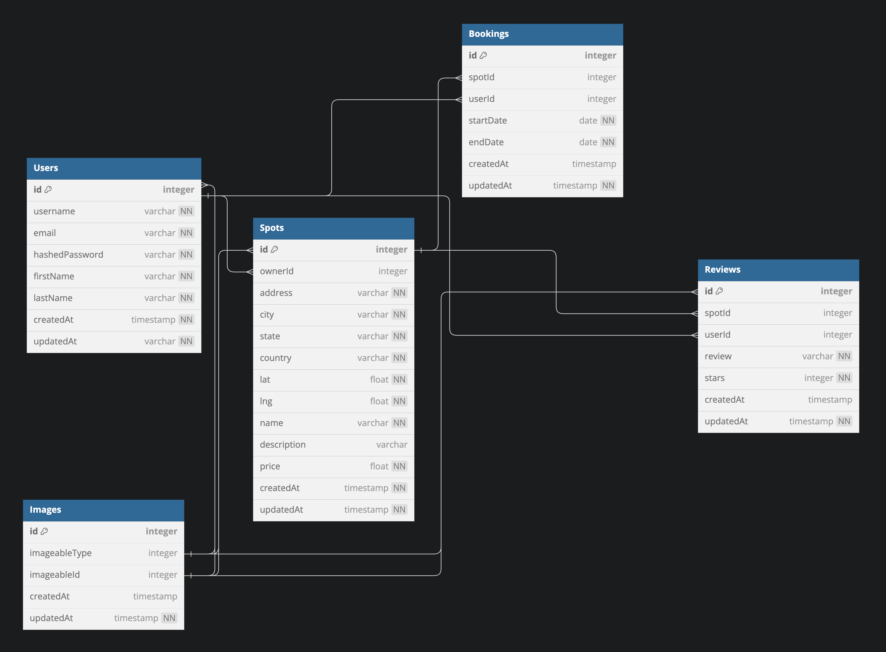

<!-- # `<name of application here>` -->

## Jono AirBnB API Project

## Database Schema Design



<details>
<summary style="font-size:1.3em; font-weight: bold">Database Schema Tables</summary>

### Users Table

| Column Name    | Data Type | Constraints      | Description |
| -------------- | --------- | ---------------- | ----------- |
| id             | INTEGER   | PK               |             |
| username       | STRING    | unique, not null |             |
| hashedPassword | STRING    | not null         |             |
| firstName      | STRING    | not null         |             |
| lastName       | STRING    | not null         |             |
| email          | STRING    | unique, not null |             |
| createdAt      | DATE      | not null         |             |
| updatedAt      | STRING    | not null         |             |

### Spots Table

| Column Name | Data Type | Constraints   | Description |
| ----------- | --------- | ------------- | ----------- |
| id          | INTEGER   | PK            |             |
| ownerId     | INTEGER   | FK > Users.id |             |
| address     | STRING    | not null      |             |
| city        | STRING    | not null      |             |
| state       | STRING    | not null      |             |
| country     | STRING    | not null      |             |
| lat         | FLOAT     | not null      |             |
| lng         | FLOAT     | not null      |             |
| name        | STRING    | not null      |             |
| description | STRING    |               |             |
| price       | FLOAT     | not null      |             |
| createdAt   | DATE      | not null      |             |
| updatedAt   | DATE      | not null      |             |

### Bookings Table

| Column Name | Data Type | Constraints   | Description |
| ----------- | --------- | ------------- | ----------- |
| id          | INTEGER   | PK            |             |
| spotId      | INTEGER   | FK > Spots.id |             |
| userId      | INTEGER   | FK > Users.id |             |
| startDate   | DATE      | not null      |             |
| endDate     | DATE      | not null      |             |
| createdAt   | DATE      |               |             |
| updatedAt   | DATE      | not null      |             |

### Reviews Table

| Column Name | Data Type | Constraints   | Description |
| ----------- | --------- | ------------- | ----------- |
| id          | INTEGER   | PK            |             |
| spotId      | INTEGER   | FK > Spots.id |             |
| userId      | INTEGER   | FK > Users.id |             |
| review      | STRING    | not null      |             |
| stars       | INTEGER   | not null      |             |
| createdAt   | DATE      |               |             |
| updatedAt   | DATE      | not null      |             |

### Images Table

| Column Name   | Data Type | Constraints | Description                   |
| ------------- | --------- | ----------- | ----------------------------- |
| id            | INTEGER   | PK          |                               |
| imageableType | INTEGER   |             | ["Users", "Spots", "Reviews"] |
| imageableId   | INTEGER   |             | belongsTo User, Spot, Review  |
| createdAt     | DATE      |             |                               |
| updatedAt     | DATE      | not null    |                               |

</details>

<!-- //# API Docs -------------------------------------------------------------- -->
<!-- //# -------------------------------------------------------------- -->

## API Documentation

## Users
https://github.com/appacademy/assessment-for-sprint-13-api-documentation-airbnb/blob/main/API-docs-AirBnB.md
<details>
<summary style="font-size:1.3em; font-weight: bold">User Authentication</summary>

<!-- ## USER AUTHENTICATION/AUTHORIZATION -->
<!-- //# ---------------------------------------- -->

### ✅All endpoints that require authentication

All endpoints that require a current user to be logged in.

- Request: endpoints that require authentication
- Error Response: Require authentication

  - Status Code: 401
  - Headers:
    - Content-Type: application/json
  - Body:

    ```json
    {
      "message": "Authentication required"
    }
    ```

### ✅All endpoints that require proper authorization

All endpoints that require authentication and the current user does not have the
correct role(s) or permission(s).

- Request: endpoints that require proper authorization
- Error Response: Require proper authorization

  - Status Code: 403
  - Headers:
    - Content-Type: application/json
  - Body:

    ```json
    {
      "message": "Forbidden"
    }
    ```

### ✅Get the Current User

Returns the information about the current user that is logged in.

- Require Authentication: true
- Request

  - Method: GET
  - URL: /api/session
  - Body: none

- Successful Response when there is a logged in user

  - Status Code: 200
  - Headers:
    - Content-Type: application/json
  - Body:

    ```json
    {
      "user": {
        "id": 1,
        "firstName": "John",
        "lastName": "Smith",
        "email": "john.smith@gmail.com",
        "username": "JohnSmith"
      }
    }
    ```

- Successful Response when there is no logged in user

  - Status Code: 200
  - Headers:
    - Content-Type: application/json
  - Body:

    ```json
    {
      "user": null
    }
    ```

### ✅Sign Up a User

Creates a new user, logs them in as the current user, and returns the current
user's information.

- Require Authentication: false
- Request

  - Method: POST
  - URL: api/users
  - Headers:
    - Content-Type: application/json
  - Body:

    ```json
    {
      "firstName": "John",
      "lastName": "Smith",
      "email": "john.smith@gmail.com",
      "username": "JohnSmith",
      "password": "secret password"
    }
    ```

- Successful Response

  - Status Code: 200
  - Headers:
    - Content-Type: application/json
  - Body:

    ```json
    {
      "user": {
        "id": 1,
        "firstName": "John",
        "lastName": "Smith",
        "email": "john.smith@gmail.com",
        "username": "JohnSmith"
      }
    }
    ```

- Error response: User already exists with the specified email

  - Status Code: 500
  - Headers:
    - Content-Type: application/json
  - Body:

    ```json
    {
      "message": "User already exists",
      "errors": {
        "email": "User with that email already exists"
      }
    }
    ```

- Error response: User already exists with the specified username

  - Status Code: 500
  - Headers:
    - Content-Type: application/json
  - Body:

    ```json
    {
      "message": "User already exists",
      "errors": {
        "username": "User with that username already exists"
      }
    }
    ```

- Error response: Body validation errors

  - Status Code: 400
  - Headers:
    - Content-Type: application/json
  - Body:

    ```json
    {
      "message": "Bad Request", // (or "Validation error" if generated by Sequelize),
      "errors": {
        "email": "Invalid email",
        "username": "Username is required",
        "firstName": "First Name is required",
        "lastName": "Last Name is required"
      }
    }
    ```

### ✅Log In a User

Logs in a current user with valid credentials and returns the current user's
information.

- Require Authentication: false
- Request

  - Method: POST
  - URL: api/session
  - Headers:
    - Content-Type: application/json
  - Body:

    ```json
    {
      "credential": "john.smith@gmail.com",
      "password": "secret password"
    }
    ```

- Successful Response

  - Status Code: 200
  - Headers:
    - Content-Type: application/json
  - Body:

    ```json
    {
      "user": {
        "id": 1,
        "firstName": "John",
        "lastName": "Smith",
        "email": "john.smith@gmail.com",
        "username": "JohnSmith"
      }
    }
    ```

- Error Response: Invalid credentials

  - Status Code: 401
  - Headers:
    - Content-Type: application/json
  - Body:

    ```json
    {
      "message": "Invalid credentials"
    }
    ```

- Error response: Body validation errors

  - Status Code: 400
  - Headers:
    - Content-Type: application/json
  - Body:

    ```json
    {
      "message": "Bad Request", // (or "Validation error" if generated by Sequelize),
      "errors": {
        "credential": "Email or username is required",
        "password": "Password is required"
      }
    }
    ```


  //# --------------------------------------------------------------
  </details>

## SPOTS

<!-- //# SPOTS ---------------------------------------- -->

<details>
<summary style="font-size:1.3em; font-weight: bold">Spots</summary>

### ✅Get all Spots

Returns all the spots.

- Require Authentication: false
- Request

  - Method: GET
  - URL: /api/spots
  - Body: none

- Successful Response

  - Status Code: 200
  - Headers:
    - Content-Type: application/json
  - Body:

    ```json
    {
      "Spots": [
        {
          "id": 1,
          "ownerId": 1,
          "address": "123 Disney Lane",
          "city": "San Francisco",
          "state": "California",
          "country": "United States of America",
          "lat": 37.7645358,
          "lng": -122.4730327,
          "name": "App Academy",
          "description": "Place where web developers are created",
          "price": 123,
          "createdAt": "2021-11-19 20:39:36",
          "updatedAt": "2021-11-19 20:39:36",
          "avgRating": 4.5,
          "previewImage": "image url"
        }
      ]
    }
    ```

### ✅Get all Spots owned by the Current User

Returns all the spots owned (created) by the current user.

- Require Authentication: true
- Request

  - Method: GET
  - URL: /api/spots/current
  - Body: none

- Successful Response

  - Status Code: 200
  - Headers:
    - Content-Type: application/json
  - Body:

    ```json
    {
      "Spots": [
        {
          "id": 1,
          "ownerId": 1,
          "address": "123 Disney Lane",
          "city": "San Francisco",
          "state": "California",
          "country": "United States of America",
          "lat": 37.7645358,
          "lng": -122.4730327,
          "name": "App Academy",
          "description": "Place where web developers are created",
          "price": 123,
          "createdAt": "2021-11-19 20:39:36",
          "updatedAt": "2021-11-19 20:39:36",
          "avgRating": 4.5,
          "previewImage": "image url"
        }
      ]
    }
    ```

### 🚨Get details of a Spot from an id

<!--// need to check preview null for any after first image -->
<!-- added numReviews, check in production -->
Returns the details of a spot specified by its id.

- Require Authentication: false
- Request

  - Method: GET
  - URL: /api/spots/:spotId
  - Body: none

- Successful Response

  - Status Code: 200
  - Headers:
    - Content-Type: application/json
  - Body:

    ```json
    {
      "id": 1,
      "ownerId": 1,
      "address": "123 Disney Lane",
      "city": "San Francisco",
      "state": "California",
      "country": "United States of America",
      "lat": 37.7645358,
      "lng": -122.4730327,
      "name": "App Academy",
      "description": "Place where web developers are created",
      "price": 123,
      "createdAt": "2021-11-19 20:39:36",
      "updatedAt": "2021-11-19 20:39:36",
      "numReviews": 5,
      "avgStarRating": 4.5,
      "SpotImages": [
        {
          "id": 1,
          "url": "image url",
          "preview": true
        },
        {
          "id": 2,
          "url": "image url",
          "preview": false
        }
      ],
      "Owner": {
        "id": 1,
        "firstName": "John",
        "lastName": "Smith"
      }
    }
    ```

- Error response: Couldn't find a Spot with the specified id

  - Status Code: 404
  - Headers:
    - Content-Type: application/json
  - Body:

    ```json
    {
      "message": "Spot couldn't be found"
    }
    ```

### ✅Create a Spot

Creates and returns a new spot.

- Require Authentication: true
- Request

  - Method: POST
  - URL: /api/spots
  - Headers:
    - Content-Type: application/json
  - Body:

    ```json
    {
      "address": "123 Disney Lane",
      "city": "San Francisco",
      "state": "California",
      "country": "United States of America",
      "lat": 37.7645358,
      "lng": -122.4730327,
      "name": "App Academy",
      "description": "Place where web developers are created",
      "price": 123
    }
    ```

- Successful Response

  - Status Code: 201
  - Headers:
    - Content-Type: application/json
  - Body:

    ```json
    {
      "id": 1,
      "ownerId": 1,
      "address": "123 Disney Lane",
      "city": "San Francisco",
      "state": "California",
      "country": "United States of America",
      "lat": 37.7645358,
      "lng": -122.4730327,
      "name": "App Academy",
      "description": "Place where web developers are created",
      "price": 123,
      "createdAt": "2021-11-19 20:39:36",
      "updatedAt": "2021-11-19 20:39:36"
    }
    ```

- Error Response: Body validation error

  - Status Code: 400
  - Headers:
    - Content-Type: application/json
  - Body:

    ```json
    {
      "message": "Bad Request", // (or "Validation error" if generated by Sequelize),
      "errors": {
        "address": "Street address is required",
        "city": "City is required",
        "state": "State is required",
        "country": "Country is required",
        "lat": "Latitude is not valid",
        "lng": "Longitude is not valid",
        "name": "Name must be less than 50 characters",
        "description": "Description is required",
        "price": "Price per day is required"
      }
    }
    ```

### ✅Add an Image to a Spot based on the Spot's id

Create and return a new image for a spot specified by id.

- Require Authentication: true
- Require proper authorization: Spot must belong to the current user
- Request

  - Method: POST
  - URL: /api/spots/:spotId/images
  - Headers:
    - Content-Type: application/json
  - Body:

    ```json
    {
      "url": "image url",
      "preview": true
    }
    ```

- Successful Response

  - Status Code: 200
  - Headers:
    - Content-Type: application/json
  - Body:

    ```json
    {
      "id": 1,
      "url": "image url",
      "preview": true
    }
    ```

- Error response: Couldn't find a Spot with the specified id

  - Status Code: 404
  - Headers:
    - Content-Type: application/json
  - Body:

    ```json
    {
      "message": "Spot couldn't be found"
    }
    ```

### ✅Edit a Spot

Updates and returns an existing spot.

- Require Authentication: true
- Require proper authorization: Spot must belong to the current user
- Request

  - Method: PUT
  - URL: /api/spots/:spotId
  - Headers:
    - Content-Type: application/json
  - Body:

    ```json
    {
      "address": "123 Disney Lane",
      "city": "San Francisco",
      "state": "California",
      "country": "United States of America",
      "lat": 37.7645358,
      "lng": -122.4730327,
      "name": "App Academy",
      "description": "Place where web developers are created",
      "price": 123
    }
    ```

- Successful Response

  - Status Code: 200
  - Headers:
    - Content-Type: application/json
  - Body:

    ```json
    {
      "id": 1,
      "ownerId": 1,
      "address": "123 Disney Lane",
      "city": "San Francisco",
      "state": "California",
      "country": "United States of America",
      "lat": 37.7645358,
      "lng": -122.4730327,
      "name": "App Academy",
      "description": "Place where web developers are created",
      "price": 123,
      "createdAt": "2021-11-19 20:39:36",
      "updatedAt": "2021-11-20 10:06:40"
    }
    ```

- Error Response: Body validation error

  - Status Code: 400
  - Headers:
    - Content-Type: application/json
  - Body:

    ```json
    {
      "message": "Bad Request", // (or "Validation error" if generated by Sequelize),
      "errors": {
        "address": "Street address is required",
        "city": "City is required",
        "state": "State is required",
        "country": "Country is required",
        "lat": "Latitude is not valid",
        "lng": "Longitude is not valid",
        "name": "Name must be less than 50 characters",
        "description": "Description is required",
        "price": "Price per day is required"
      }
    }
    ```

- Error response: Couldn't find a Spot with the specified id

  - Status Code: 404
  - Headers:
    - Content-Type: application/json
  - Body:

    ```json
    {
      "message": "Spot couldn't be found"
    }
    ```

### ✅Delete a Spot

Deletes an existing spot.

- Require Authentication: true
- Require proper authorization: Spot must belong to the current user
- Request

  - Method: DELETE
  - URL: /api/spots/:spotId
  - Body: none

- Successful Response

  - Status Code: 200
  - Headers:
    - Content-Type: application/json
  - Body:

    ```json
    {
      "message": "Successfully deleted"
    }
    ```

- Error response: Couldn't find a Spot with the specified id

  - Status Code: 404
  - Headers:
    - Content-Type: application/json
  - Body:

        ```json
        {
          "message": "Spot couldn't be found"
        }
        ```

    </details>

## REVIEWS

<!-- //# REVIEWS------------------------------------------------- -->

<details>
<summary style="font-size:1.3em; font-weight: bold">Reviews</summary>

### ✅Create a Review for a Spot based on the Spot's id

<!-- I moved this up, it was below get all reviews by spotid -->

Create and return a new review for a spot specified by id.

- Require Authentication: true
- Request

  - Method: POST
  - URL: /api/spots/:spotId/reviews
  - Headers:
    - Content-Type: application/json
  - Body:

    ```json
    {
      "review": "This was an awesome spot!",
      "stars": 5
    }
    ```

- Successful Response

  - Status Code: 201
  - Headers:
    - Content-Type: application/json
  - Body:

    ```json
    {
      "id": 1,
      "userId": 1,
      "spotId": 1,
      "review": "This was an awesome spot!",
      "stars": 5,
      "createdAt": "2021-11-19 20:39:36",
      "updatedAt": "2021-11-19 20:39:36"
    }
    ```

- Error Response: Body validation errors

  - Status Code: 400
  - Headers:
    - Content-Type: application/json
  - Body:

    ```json
    {
      "message": "Bad Request", // (or "Validation error" if generated by Sequelize),
      "errors": {
        "review": "Review text is required",
        "stars": "Stars must be an integer from 1 to 5"
      }
    }
    ```

- Error response: Couldn't find a Spot with the specified id

  - Status Code: 404
  - Headers:
    - Content-Type: application/json
  - Body:

    ```json
    {
      "message": "Spot couldn't be found"
    }
    ```

- Error response: Review from the current user already exists for the Spot

  - Status Code: 500
  - Headers:
    - Content-Type: application/json
  - Body:

    ```json
    {
      "message": "User already has a review for this spot"
    }
    ```

### ✅Get all Reviews of the Current User

<!-- now returns ReviewImages, but im still not handling previewImage fully anywhere, multiple, edge cases -->

Returns all the reviews written by the current user.

- Require Authentication: true
- Request

  - Method: GET
  - URL: /api/reviews/current
  - Body: none

- Successful Response

  - Status Code: 200
  - Headers:
    - Content-Type: application/json
  - Body:

    ```json
    {
      "Reviews": [
        {
          "id": 1,
          "userId": 1,
          "spotId": 1,
          "review": "This was an awesome spot!",
          "stars": 5,
          "createdAt": "2021-11-19 20:39:36",
          "updatedAt": "2021-11-19 20:39:36",
          "User": {
            "id": 1,
            "firstName": "John",
            "lastName": "Smith"
          },
          "Spot": {
            "id": 1,
            "ownerId": 1,
            "address": "123 Disney Lane",
            "city": "San Francisco",
            "state": "California",
            "country": "United States of America",
            "lat": 37.7645358,
            "lng": -122.4730327,
            "name": "App Academy",
            "price": 123,
            "previewImage": "image url"
          },
          "ReviewImages": [
            {
              "id": 1,
              "url": "image url"
            }
          ]
        }
      ]
    }
    ```

### ✅Get all Reviews by a Spot's id

Returns all the reviews that belong to a spot specified by id.

- Require Authentication: false
- Request

  - Method: GET
  - URL: /api/spots/:spotId/reviews
  - Body: none

- Successful Response

  - Status Code: 200
  - Headers:
    - Content-Type: application/json
  - Body:

    ```json
    {
      "Reviews": [
        {
          "id": 1,
          "userId": 1,
          "spotId": 1,
          "review": "This was an awesome spot!",
          "stars": 5,
          "createdAt": "2021-11-19 20:39:36",
          "updatedAt": "2021-11-19 20:39:36",
          "User": {
            "id": 1,
            "firstName": "John",
            "lastName": "Smith"
          },
          "ReviewImages": [
            {
              "id": 1,
              "url": "image url"
            }
          ]
        }
      ]
    }
    ```

- Error response: Couldn't find a Spot with the specified id

  - Status Code: 404
  - Headers:
    - Content-Type: application/json
  - Body:

    ```json
    {
      "message": "Spot couldn't be found"
    }
    ```

### ✅Add an Image to a Review based on the Review's id

Create and return a new image for a review specified by id.

- Require Authentication: true
- Require proper authorization: Review must belong to the current user
- Request

  - Method: POST
  - URL: /api/reviews/:reviewId/images
  - Headers:
    - Content-Type: application/json
  - Body:

    ```json
    {
      "url": "image url"
    }
    ```

- Successful Response

  - Status Code: 200
  - Headers:
    - Content-Type: application/json
  - Body:

    ```json
    {
      "id": 1,
      "url": "image url"
    }
    ```

- Error response: Couldn't find a Review with the specified id

  - Status Code: 404
  - Headers:
    - Content-Type: application/json
  - Body:

    ```json
    {
      "message": "Review couldn't be found"
    }
    ```

- Error response: Cannot add any more images because there is a maximum of 10
  images per resource

  - Status Code: 403
  - Headers:
    - Content-Type: application/json
  - Body:

    ```json
    {
      "message": "Maximum number of images for this resource was reached"
    }
    ```

### ✅Edit a Review

Update and return an existing review.

- Require Authentication: true
- Require proper authorization: Review must belong to the current user
- Request

  - Method: PUT
  - URL: /api/reviews/:reviewId
  - Headers:
    - Content-Type: application/json
  - Body:

    ```json
    {
      "review": "This was an awesome spot!",
      "stars": 5
    }
    ```

- Successful Response

  - Status Code: 200
  - Headers:
    - Content-Type: application/json
  - Body:

    ```json
    {
      "id": 1,
      "userId": 1,
      "spotId": 1,
      "review": "This was an awesome spot!",
      "stars": 5,
      "createdAt": "2021-11-19 20:39:36",
      "updatedAt": "2021-11-20 10:06:40"
    }
    ```

- Error Response: Body validation errors

  - Status Code: 400
  - Headers:
    - Content-Type: application/json
  - Body:

    ```json
    {
      "message": "Bad Request", // (or "Validation error" if generated by Sequelize),
      "errors": {
        "review": "Review text is required",
        "stars": "Stars must be an integer from 1 to 5"
      }
    }
    ```

- Error response: Couldn't find a Review with the specified id

  - Status Code: 404
  - Headers:
    - Content-Type: application/json
  - Body:

    ```json
    {
      "message": "Review couldn't be found"
    }
    ```

### ✅Delete a Review

Delete an existing review.

- Require Authentication: true
- Require proper authorization: Review must belong to the current user
- Request

  - Method: DELETE
  - URL: /api/reviews/:reviewId
  - Body: none

- Successful Response

  - Status Code: 200
  - Headers:
    - Content-Type: application/json
  - Body:

    ```json
    {
      "message": "Successfully deleted"
    }
    ```

- Error response: Couldn't find a Review with the specified id

  - Status Code: 404
  - Headers:
    - Content-Type: application/json
  - Body:

    ```json
    {
      "message": "Review couldn't be found"
    }
    ```

  ```

  ```

  </details>

## BOOKINGS

<!-- //# BOOKINGS------------------------------------------------- -->

<details>
<summary style="font-size:1.3em; font-weight: bold">Bookings</summary>

### ✅Get all of the Current User's Bookings

Return all the bookings that the current user has made.

- Require Authentication: true
- Request

  - Method: GET
  - URL: /api/bookings/current
  - Body: none

- Successful Response

  - Status Code: 200
  - Headers:
    - Content-Type: application/json
  - Body:

    ```json
    {
      "Bookings": [
        {
          "id": 1,
          "spotId": 1,
          "Spot": {
            "id": 1,
            "ownerId": 1,
            "address": "123 Disney Lane",
            "city": "San Francisco",
            "state": "California",
            "country": "United States of America",
            "lat": 37.7645358,
            "lng": -122.4730327,
            "name": "App Academy",
            "price": 123,
            "previewImage": "image url"
          },
          "userId": 2,
          "startDate": "2021-11-19",
          "endDate": "2021-11-20",
          "createdAt": "2021-11-19 20:39:36",
          "updatedAt": "2021-11-19 20:39:36"
        }
      ]
    }
    ```

### ✅Get all Bookings for a Spot based on the Spot's id

Return all the bookings for a spot specified by id.

- Require Authentication: true
- Request

  - Method: GET
  - URL: /api/spots/:spotId/bookings
  - Body: none

- Successful Response: If you ARE NOT the owner of the spot.

  - Status Code: 200
  - Headers:
    - Content-Type: application/json
  - Body:

    ```json
    {
      "Bookings": [
        {
          "spotId": 1,
          "startDate": "2021-11-19",
          "endDate": "2021-11-20"
        }
      ]
    }
    ```

- Successful Response: If you ARE the owner of the spot.

  - Status Code: 200
  - Headers:
    - Content-Type: application/json
  - Body:

    ```json
    {
      "Bookings": [
        {
          "User": {
            "id": 2,
            "firstName": "John",
            "lastName": "Smith"
          },
          "id": 1,
          "spotId": 1,
          "userId": 2,
          "startDate": "2021-11-19",
          "endDate": "2021-11-20",
          "createdAt": "2021-11-19 20:39:36",
          "updatedAt": "2021-11-19 20:39:36"
        }
      ]
    }
    ```

- Error response: Couldn't find a Spot with the specified id

  - Status Code: 404
  - Headers:
    - Content-Type: application/json
  - Body:

    ```json
    {
      "message": "Spot couldn't be found"
    }
    ```

### ✅Create a Booking from a Spot based on the Spot's id

Create and return a new booking from a spot specified by id.

- Require Authentication: true
- Require proper authorization: Spot must NOT belong to the current user
- Request

  - Method: POST
  - URL: /api/spots/:spotId/bookings
  - Body:

    ```json
    {
      "startDate": "2021-11-19",
      "endDate": "2021-11-20"
    }
    ```

- Successful Response

  - Status Code: 200
  - Headers:
    - Content-Type: application/json
  - Body:

    ```json
    {
      "id": 1,
      "spotId": 1,
      "userId": 2,
      "startDate": "2021-11-19",
      "endDate": "2021-11-20",
      "createdAt": "2021-11-19 20:39:36",
      "updatedAt": "2021-11-19 20:39:36"
    }
    ```

- Error response: Body validation errors

  - Status Code: 400
  - Headers:
    - Content-Type: application/json
  - Body:

    ```json
    {
      "message": "Bad Request", // (or "Validation error" if generated by Sequelize),
      "errors": {
        "endDate": "endDate cannot be on or before startDate"
      }
    }
    ```

- Error response: Couldn't find a Spot with the specified id

  - Status Code: 404
  - Headers:
    - Content-Type: application/json
  - Body:

    ```json
    {
      "message": "Spot couldn't be found"
    }
    ```

- Error response: Booking conflict

  - Status Code: 403
  - Headers:
    - Content-Type: application/json
  - Body:

    ```json
    {
      "message": "Sorry, this spot is already booked for the specified dates",
      "errors": {
        "startDate": "Start date conflicts with an existing booking",
        "endDate": "End date conflicts with an existing booking"
      }
    }
    ```

### ✅Edit a Booking

Update and return an existing booking.

- Require Authentication: true
- Require proper authorization: Booking must belong to the current user
- Request

  - Method: PUT
  - URL: /api/bookings/:bookingId
  - Headers:
    - Content-Type: application/json
  - Body:

    ```json
    {
      "startDate": "2021-11-19",
      "endDate": "2021-11-20"
    }
    ```

- Successful Response

  - Status Code: 200
  - Headers:
    - Content-Type: application/json
  - Body:

    ```json
    {
      "id": 1,
      "spotId": 1,
      "userId": 2,
      "startDate": "2021-11-19",
      "endDate": "2021-11-20",
      "createdAt": "2021-11-19 20:39:36",
      "updatedAt": "2021-11-20 10:06:40"
    }
    ```

- Error response: Body validation errors

  - Status Code: 400
  - Headers:
    - Content-Type: application/json
  - Body:

    ```json
    {
      "message": "Bad Request", // (or "Validation error" if generated by Sequelize),
      "errors": {
        "endDate": "endDate cannot come before startDate"
      }
    }
    ```

- Error response: Couldn't find a Booking with the specified id

  - Status Code: 404
  - Headers:
    - Content-Type: application/json
  - Body:

    ```json
    {
      "message": "Booking couldn't be found"
    }
    ```

- Error response: Can't edit a booking that's past the end date

  - Status Code: 403
  - Headers:
    - Content-Type: application/json
  - Body:

    ```json
    {
      "message": "Past bookings can't be modified"
    }
    ```

- Error response: Booking conflict

  - Status Code: 403
  - Headers:
    - Content-Type: application/json
  - Body:

    ```json
    {
      "message": "Sorry, this spot is already booked for the specified dates",
      "errors": {
        "startDate": "Start date conflicts with an existing booking",
        "endDate": "End date conflicts with an existing booking"
      }
    }
    ```

### ✅Delete a Booking

Delete an existing booking.

- Require Authentication: true
- Require proper authorization: Booking must belong to the current user or the
  Spot must belong to the current user
- Request

  - Method: DELETE
  - URL: /api/bookings/:bookingId
  - Body: none

- Successful Response

  - Status Code: 200
  - Headers:
    - Content-Type: application/json
  - Body:

    ```json
    {
      "message": "Successfully deleted"
    }
    ```

- Error response: Couldn't find a Booking with the specified id

  - Status Code: 404
  - Headers:
    - Content-Type: application/json
  - Body:

    ```json
    {
      "message": "Booking couldn't be found"
    }
    ```

- Error response: Bookings that have been started can't be deleted

  - Status Code: 403
  - Headers:
    - Content-Type: application/json
  - Body:

        ```json
        {
          "message": "Bookings that have been started can't be deleted"
        }
        ```

    </details>

## IMAGES

<!-- //# IMAGES------------------------------------------------- -->

<details>
<summary style="font-size:1.3em; font-weight: bold">Images</summary>

### ✅Delete a Spot Image

Delete an existing image for a Spot.

- Require Authentication: true
- Require proper authorization: Spot must belong to the current user
- Request

  - Method: DELETE
  - URL: /api/spot-images/:images
  - Body: none

- Successful Response

  - Status Code: 200
  - Headers:
    - Content-Type: application/json
  - Body:

    ```json
    {
      "message": "Successfully deleted"
    }
    ```

- Error response: Couldn't find a Spot Image with the specified id

  - Status Code: 404
  - Headers:
    - Content-Type: application/json
  - Body:

    ```json
    {
      "message": "Spot Image couldn't be found"
    }
    ```

### ✅Delete a Review Image

Delete an existing image for a Review.

- Require Authentication: true
- Require proper authorization: Review must belong to the current user
- Request

  - Method: DELETE
  - URL: /api/review-images/imageId
  - Body: none

- Successful Response

  - Status Code: 200
  - Headers:
    - Content-Type: application/json
  - Body:

    ```json
    {
      "message": "Successfully deleted"
    }
    ```

- Error response: Couldn't find a Review Image with the specified id

  - Status Code: 404
  - Headers:
    - Content-Type: application/json
  - Body:

    ```json
    {
      "message": "Review Image couldn't be found"
    }
    ```

## QUERY PARAMS

<!-- //# Add Query Filters to Get All Spots------------------------------------------------- -->

<details>
<summary style="font-size:1.3em; font-weight: bold">Add Query Filters to Get All Spots</summary>

## ✅Return spots filtered by query parameters.

- Require Authentication: false
- Request

  - Method: GET
  - URL: /api/spots
  - Query Parameters
    - page: integer, minimum: 1, maximum: 10, default: 1
    - size: integer, minimum: 1, maximum: 20, default: 20
    - minLat: decimal, optional
    - maxLat: decimal, optional
    - minLng: decimal, optional
    - maxLng: decimal, optional
    - minPrice: decimal, optional, minimum: 0
    - maxPrice: decimal, optional, minimum: 0
  - Body: none

- Successful Response

  - Status Code: 200
  - Headers:
    - Content-Type: application/json
  - Body:

    ```json
    {
      "Spots": [
        {
          "id": 1,
          "ownerId": 1,
          "address": "123 Disney Lane",
          "city": "San Francisco",
          "state": "California",
          "country": "United States of America",
          "lat": 37.7645358,
          "lng": -122.4730327,
          "name": "App Academy",
          "description": "Place where web developers are created",
          "price": 123,
          "createdAt": "2021-11-19 20:39:36",
          "updatedAt": "2021-11-19 20:39:36",
          "avgRating": 4.5,
          "previewImage": "image url"
        }
      ],
      "page": 2,
      "size": 25
    }
    ```

- Error Response: Query parameter validation errors

  - Status Code: 400
  - Headers:
    - Content-Type: application/json
  - Body:

        ```json
        {
          "message": "Bad Request", // (or "Validation error" if generated by Sequelize),
          "errors": {
            "page": "Page must be greater than or equal to 1",
            "size": "Size must be greater than or equal to 1",
            "maxLat": "Maximum latitude is invalid",
            "minLat": "Minimum latitude is invalid",
            "minLng": "Maximum longitude is invalid",
            "maxLng": "Minimum longitude is invalid",
            "minPrice": "Minimum price must be greater than or equal to 0",
            "maxPrice": "Maximum price must be greater than or equal to 0"
          }
        }
        ```

    </details>
